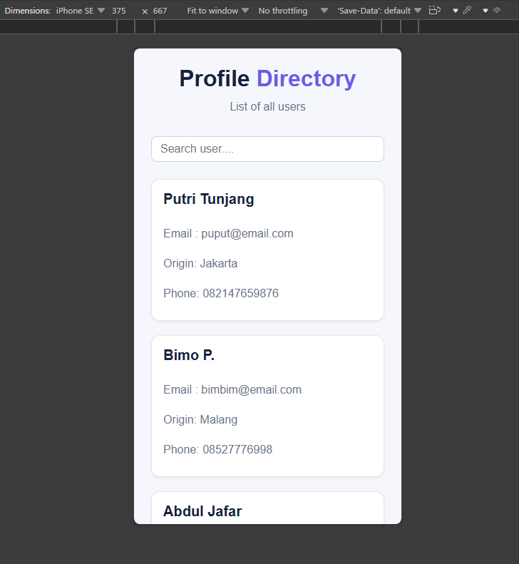
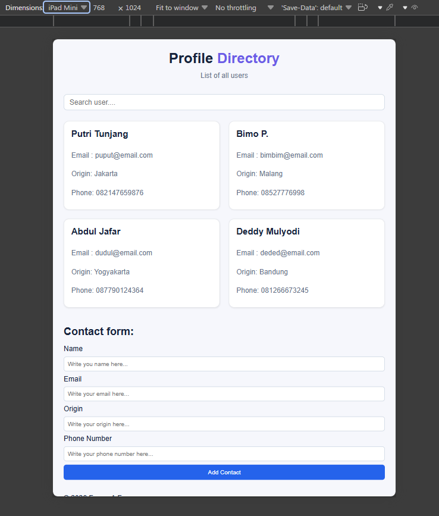
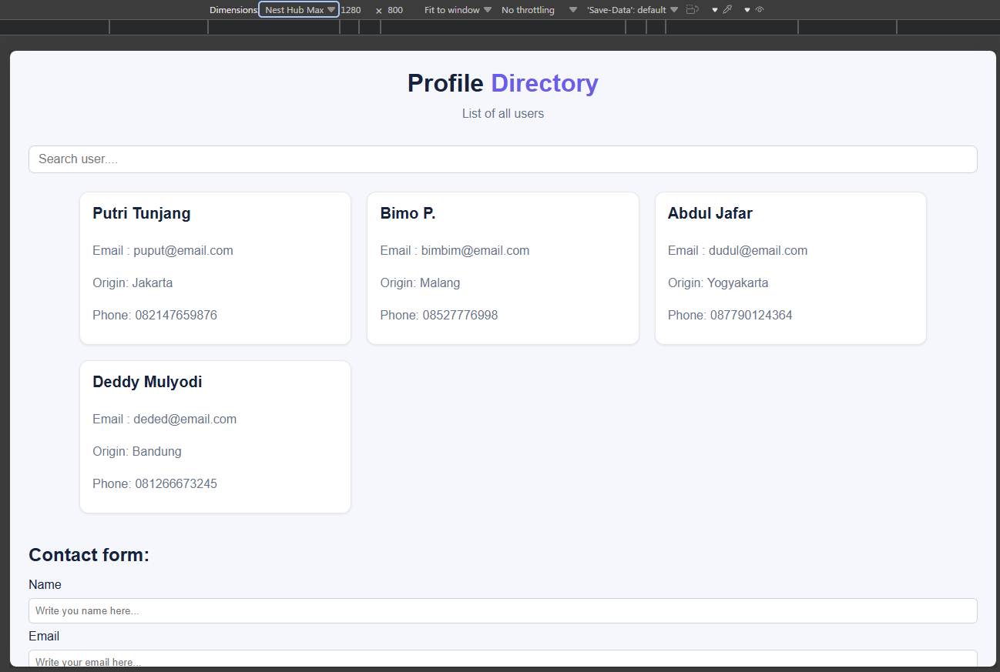
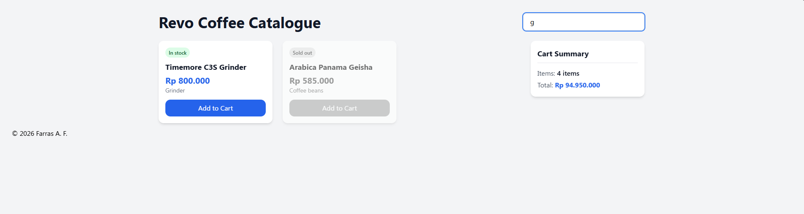

# Assignment Module 3

This repository contains two front-end assignments: a Profile Directory page built with plain HTML/CSS/JavaScript, and a Coffee Product Catalogue built with TypeScript and Tailwind CSS.

## Project Structure

```
assignment-module-3/
├── html-css-javascript/     # Profile Directory (vanilla HTML/CSS/JS)
├── typescript-tailwind/     # Coffee Product Catalogue (TypeScript + Tailwind)
└── screenshots (*.png)      # Preview images (see Screenshots below)
```

### `html-css-javascript/`
The Profile Directory page, built with plain HTML, CSS, and JavaScript (no build step).

- `assignment-3.html` — page markup (profile list, live search, contact form)
- `assignment-3.css` — styling, including responsive layout for mobile/tablet/desktop
- `assignment-3.js` — rendering logic and live search behavior

**How to run/open locally:**
Just open `assignment-3.html` in your browser (double-click it, or right-click → Open with → your browser). No installation or build step required.

### `typescript-tailwind/`
The Revo Coffee Catalogue, built with TypeScript and Tailwind CSS. This one needs a build step because the `.ts` source is compiled to JavaScript and Tailwind generates the CSS.

- `src/` — source files
  - `assignment-3.ts` — product catalogue logic (rendering, cart, live search)
  - `assignment-3.html` — page markup
  - `input.css` — Tailwind entry point (`@tailwind base/components/utilities`)
- `dist/` — build output
  - `assignment-3.js` — compiled JavaScript
  - `output.css` — generated Tailwind CSS
- `tailwind.config.js` — Tailwind config (scans `.html`, `.js`, and `.ts` files)
- `tsconfig.json` — TypeScript compiler config
- `package.json` — dependencies

**How to run/open locally:**

1. Install dependencies:
   ```bash
   npm install
   ```
2. Build the CSS (generates `dist/output.css`):
   ```bash
   npx tailwindcss -i ./src/input.css -o ./dist/output.css
   ```
3. Compile the TypeScript (generates `dist/assignment-3.js`):
   ```bash
   npx tsc
   ```
4. Open `src/assignment-3.html` in your browser. It references `../dist/output.css` and `../dist/assignment-3.js`.

> Tip: if you change styles or `.ts` code, re-run steps 2 and 3 to regenerate the `dist/` output.

## Screenshots

### Profile Page — Responsive Views

**Mobile**



**Tablet**



**Desktop**



### Product Catalogue — Live Search


